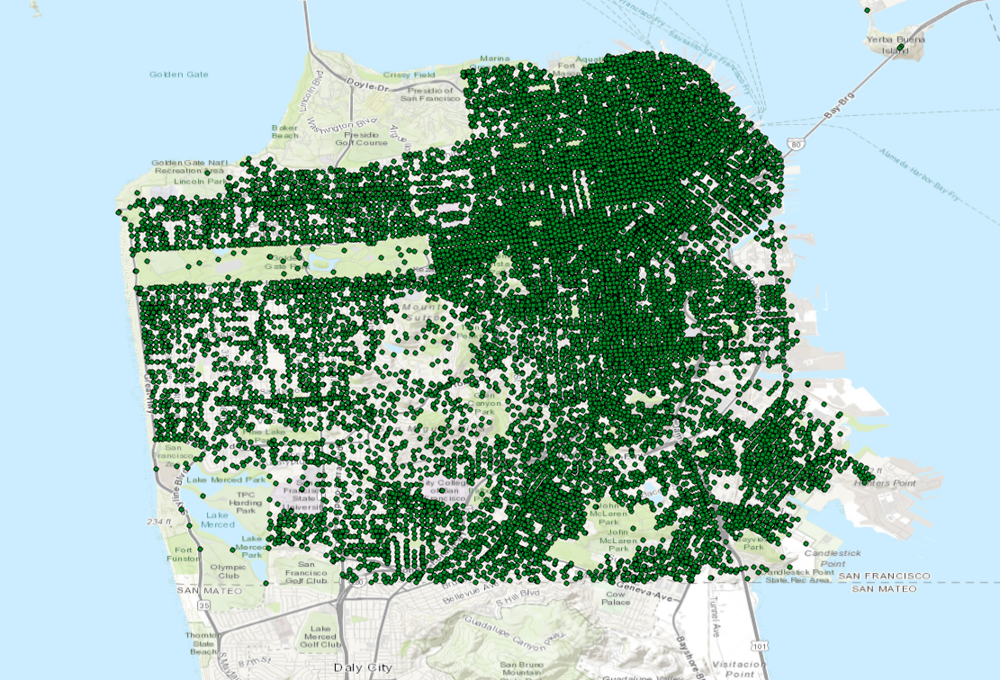
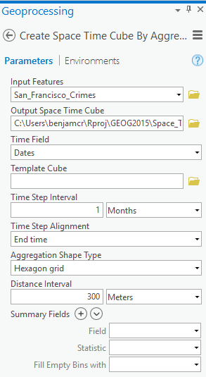
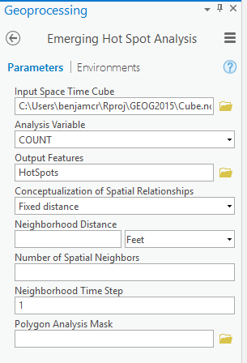
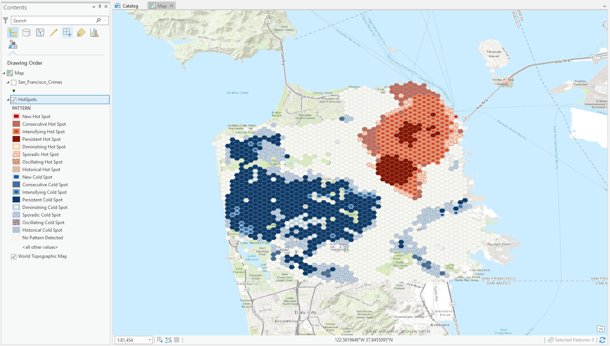
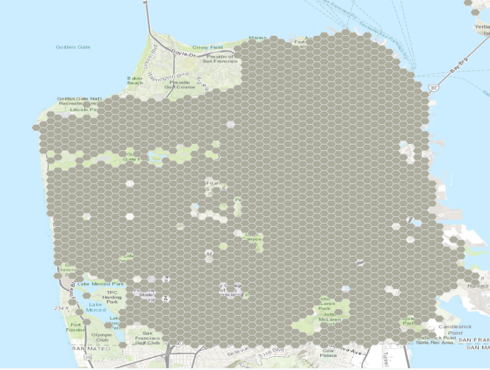
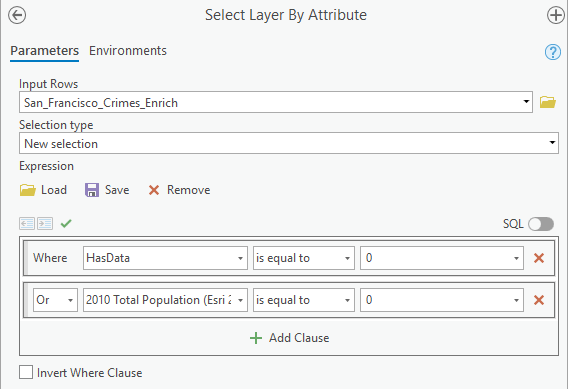
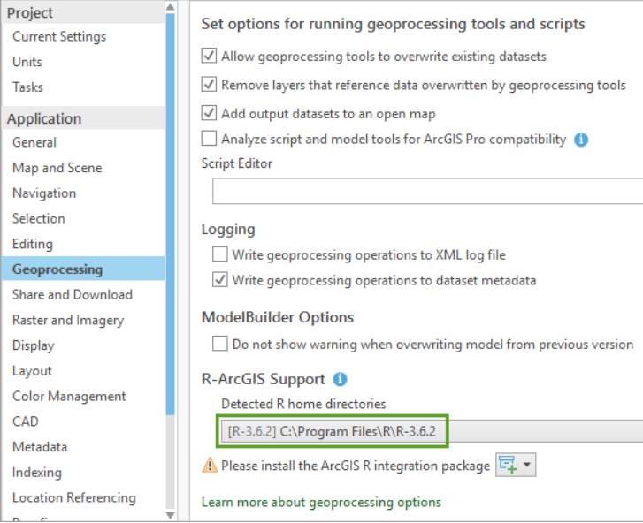
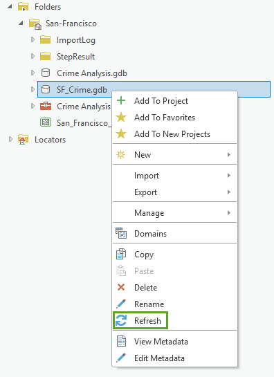
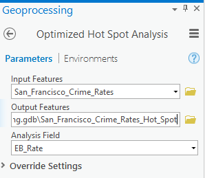
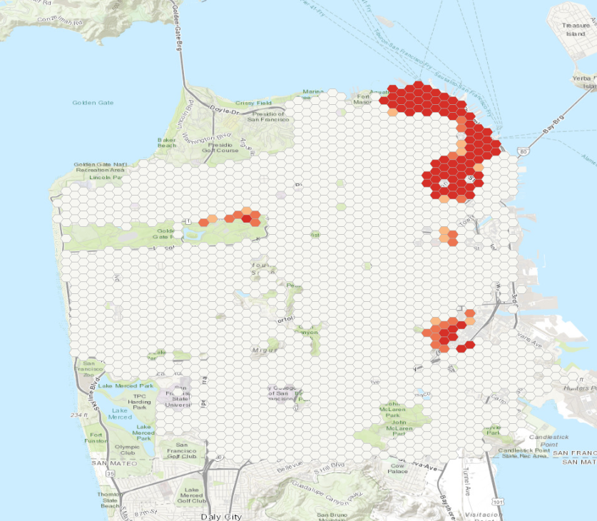

In this project you will analyse crime data from the San Francisco police department. You will learn how to identify cold and hot spots of crime and use the R-ArcGIS bridge to carry out statistical analysis and visualize the results of your analysis.

# Step 1: Get started

First of all, create a folder "CrimeProj" in which you will save your work and all the documents related to this project. 

Download the crime data (CrimeData.zip) that you will find in the folder "Crime project" on BlackBoard. Once this is done, save the data in your folder and import the data in ArcGIS Pro. Add a new basemap.

Your ArcGIS pane should look like this:

```{r, echo = FALSE}

```
Note that you may have to change the coordinate system of your map, as you learned during the labs.

# Step 2: Isolate your crime data

Open the attribute table of your data. You will find 12 columns and 74760 observations in this dataset. Each "observation" represents one crime. Regarding the columns:

- **OBJECTID** : is the identifying number of your point.
- **Shape** : either your observation is a point, a line or a polygon. Here, all observations are points.
- **Field1** : another identifying number for your observation.
- **Data** : when the crime has been committed.
- **Category** : the crime which has been committed.
- **Descript** : a short description of the crime.
- **DayOfWeek** : the day of the week the crime has been committed.
- **PdDct** : the district in which the crime has been committed.
- **Resolution** : what has the police done.
- **Adress** : where did the call alerting the crime came from.
- **X & Y** : the coordinates of the crime.

Refer to the pdf "Crime4me" where you will find the day of the week you are supposed to work with.

# Step 3: Aggregate point data by counts within a defined location

The number of points is too overwhelming to do any visual analysis or to be able to detect any patterns. Before we continue further we need to aggregate crime counts in space and time. This may reveal patterns impossible to detect otherwise.

- In the **Geoprocessing pane**, search for ´Create Space Time Cube´
- Click on the tool `Create Space Time Cube By Aggregating Points`
- Change the parameters with the following and run:

```{r, echo = FALSE}

```

This will create a netCDF file (.nc) which allows you to view spatial patterns and trend over time. The tool aggregated the "crime points" into hexagons. Each hexagon represents an area of approximately 78,000 square meters. The Distance Interval and Time Step Interval parameters impact the number of resulting bins and the size of each bin. These values can be chosen based on prior knowledge of the analysis area, or the tool will calculate values for you based on the spatial distribution of your data.

# Step 4: Analyze crime hot spots

At this point you should be able to analyze your data and look at where clusters of crime are emerging. In the **Geoprocessing** pane, search for and open `Emergins Hot Spot Analysis` tool.

Change the parameters as follow:

```{r, echo = FALSE}

```

By using the default value for Neighborhood Distance, you are letting the tool calculate a distance band for you based on the spatial distribution of your data. The Neighborhood Time Step value is set to one time step interval (one month in this case) by default. 

**WARNING**: Do not change where the "Output Features" is stored, otherwise ArcGIS will fail to run the tool.

Your map should look like this:

```{r, echo = FALSE}

```

You should be able to quickly vizualise the cold spots (in blue) and the hot spots (in red). Red areas indicate that over time there has been clustering of high numbers of crime, and blue areas indicate that over time there has been clustering of low numbers of crime. Each location is categorized based on the trends in clustering over time.

The dark red hexagon bins are persistent hot spots. These locations do not have a discernible increase or decrease in the intensity of clustering of crime counts over time. In contrast, the light red with beige outlined hexagon bins are intensifying hot spots. In addition, these are locations where the intensity of clustering of crime counts is increasing over time, and that increase is statistically significant.

Conversely, the dark blue bins are persistent cold spots. These are areas where crime is less prevalent. The light blue outlined bins are intensifying cold spots but means the opposite of its counterpart. Clusters of low crime counts in these cells are becoming more intense over time. In other words, the cold spots are getting colder.

# Step 5: Going further in the analysis

Now that you know where crime hot spots are emerging, you'll try to determine why they are emerging. In particular, you'll examine the relationship between an area's crime and its population. 

Statistical analysis can determine if the number of crimes occurring in a particular area is influenced by population. In addition, we will be interested in analyzing the presence of certain types of businesses, as well as the prevalence of parks, the amount of public land in a given area (hexagon bins), the median household income and home value, among other factors.

Currently, the hexagon bins in the space time cube layer contain no attribute information suitable for this kind of analysis. You'll run another geoprocessing tool to enrich the layer with relevant attribute information.

For this exercise we won't use the **Enrich** tool as it consumes "ArcGIS credit". Nevertheless the enriched data can be found in the zip file you downloaded on BlackBoard. In **CrimeDat**, under **StepResult** you will find a **Result.gdb** which itself contains **San_Francisco_Crimes_Enrich**. Import the latter in your ArcGIS Project.

You should be able to vizualise a map similar to below:

```{r, echo = FALSE}

```

If you open the attribue table your data should have the following columns added:

- **HasData** : Indicates whether the Enrich Layer tool found data for the given hexagon bin, with 0 meaning a hexagon had no available data for all of the attributes you selected and 1 meaning a hexagon bin had data for at least one of the attributes you selected. You can use this field to filter your data so that only features with relevant attribute information appear on the map.
- **2010 Total Population (Esri 2019) (historicalpopulation_tspop10_cy)** : Contains the population count per hexagon bin. Some hexagons have a population of 0. A hexagon bin may have a population of 0 because it is located in an industrial area or in a park. The first priority of your department is to reduce crimes in populated areas, so you'll focus only on populated locations.
- **2019 Median Home Value (wealth_medval_cy)** : Contains the median home value per hexagon bin.
- **2019 Median Household Income (wealth_medhinc_cy)** : Contains the median household income value per hexagon bin.
- **2019 Renter Occupied HUs (ownerrenter_renter_cy)** : Contains the number of renter occupied households per hexagon bin.
- **Food & Beverage Stores Bus (NAICS) (businesses_n13_bus)** : Contains the count of food and beverage stores located within each hexagon bin.
- **Food Service/Drinking Estab Bus (NAICS) (businesses_n37_bus)** : Contains the count of businesses that serve food, beverages, or both located within each hexagon bin.

# Step 6: Prepare your dataset for additional analysis

Next, you'll select the data that is relevant to your analysis and make a subset with only that information. 

- In **Geoprocessing** search for and open the **Select Layer by Attribute** tool.
- Change the parameters with the following:

```{r, echo = FALSE}

```

- Click **Run**. Here, The tool runs and selects features that have no enriched data, or that have zero population. These may be industrial sites or parks.
- Open the attribute table for the **San_Francisco_Crimes_Enrich** layer. The table indicates that 222 of 1,996 rows are selected, meaning they have 0 values for the HasData or 2010 Total Population (Esri 2019) fields. 
- You'll create a new dataset without these selected features so you can focus on features that have data relevant to your analysis. You will call this new layer **San_Francisco_Crimes_Enrich_Subset**. I am not giving further information on how to do this since this is a basic operation you should be able to achieve.

# Step 7: Bridge your data into R

First of all we need to intall the **R-ArcGIS bridge**. Once the R-ArcGIS bridge is installed, you can begin reading and writing data to and from ArcGIS and R. This is very useful for carrying out statistical analysis on the data you handled in ArcGIS.

- Click on **Project**
- Click on **Option**, then on **Application** and **Geoprocessing**
- In the **R-ArcGIS Support section**, select your desired R home directory. This may require you to search for where R is stored on your computer.

```{r, echo = FALSE}

```

If you haven't installed the R-ArcGIS bridge, a warning indicates that you need to install the ArcGIS R integration package to connect R with ArcGIS. You can automatically download and install the package by clicking on the sign next to the warning:

- click Install package and choose **Install package from the Internet**. When asked to confirm the installation, click Yes, and when the installation is complete, click Close.

And it's done, you now have a bridge between R and ArcGIS.

# Step 8: Import your data into R

In RStudio, in the R console type and run:

```{r, eval = FALSE}
library(arcgisbinding)
```

If you receive a message such as Error in library(arcgisbinding): there is no package called `arcgisbinding`, ensure that you have correctly installed the R-ArcGIS bridge.

In the R console, also type the command:

```{r, eval = FALSE}
arc.check_product()
```

After the `arcgisbinding` package has been loaded into the RStudio workspace and the connection from R to ArcGIS has been initialized, data from your current project in ArcGIS can be loaded into the RStudio workspace. Shapefiles, feature classes from geodatabases, and tables are all valid arguments to use in the open function.

Now you will import your data in R. For this you will use the `arc.open` function.

```{r, eval = FALSE}
enrich_df <- arc.open(path = 'C:/Users/benjamcr/Rproj/GEOG2015/CrimeDat/SF_Crime.gdb/San_Francisco_Crimes_Enrich_Subset')
```

Of course, the path will depends on where you saved your **San_Francisco_Crimes_Enrich_Subset** file.

The function stores a new arc.dataset class object in the variable enrich_df. This object contains both the spatial information and the attribute information for your ArcGIS data and can now be used in other functions. The variable is listed in RStudio under Data.

With the `arc.select()` function, you can choose a subset of attributes from the enrich_df object that you want to use as data for your analysis.

Run the `arc.select()` function as shown in the following code block. For the first argument, put enrich_df as the object from which you're making a subset. For the second argument, add a character vector containing the name of each attribute from your dataset that you want in your subset and run the command.

```{r, eval = FALSE}
enrich_select_df <- arc.select(object = enrich_df, fields = c('OBJECTID', 'SUM_VALUE', 'historicalpopulation_tspop10_cy', 'wealth_medval_cy', 'wealth_medhinc_cy', 'ownerrenter_renter_cy', 'businesses_n13_bus', 'businesses_n37_bus'))
```

Your enrich_select_df variable now contains an R data frame object with the eight attributes you selected from your full original shapefile in R. These attributes include an ID value, the crime counts for each hexagon bin, and the six attributes with which the data has been enriched.

Finally, you'll convert your R data frame into a spatial data frame object using the arc.data2sp() function. A spatial data frame object is one of the spatial data classes contained in the sp package. The sp package offers classes and methods for working with spatial data such as points, lines, polygons, pixels, rings, and grids. With this function, you can transfer all of the spatial attributes from your data, including projections, from ArcGIS into R without worrying about a loss of information.

If you have never used the paaackage `sp` before you need to install it in R:

```{r, eval = FALSE}
install.packages('sp')
library(sp)
```

You can then run the function `arc.data2sp()` as shown below:

```{r, eval = FALSE}
enrich_sp <- arc.data2sp(enrich_select_df)
```

# Step 9: Calculate smoothed crime rates

All the information that you need to start your analysis is in place, but you may notice that the current attribute labels are cryptic and abbreviated as they represent the original field names from the San_Francisco_Crimes_Enrich_Subset feature class . In R, you can change the names of the enriched attributes to make them easier to identify.

First, run the following code to create a vector of names. This will be used to replace the current names of **enrich_sp**.

```{r, eval = FALSE}
col_names <- c("OBJECTID", "Crime_Counts",
"Population", "Med_HomeValue", "Med_HomeIncome",
"Renter_Count", "Grocery",
"Restaurant")

# Replace the colnames of enrich_sp by the ones you specified above
colnames(enrich_sp@data) <- col_names

# Check if the change has been made:
head(enrich_sp@data)
```
Next, you'll use the `EBest()` function to perform Empirical Bayes smoothing on your crime rates. `EBest()` function is contained in the `spdep` R package and if not already installed you should do it:

```{r, eval = FALSE}
install.packages('spdep')
library(spdep)
```

In the console, run the following lines of code to calculate Empirical Bayes smoothed crime rates for each hexagon bin.

```{r, eval = FALSE}
n <- enrich_sp@data$Crime_Counts
x <- enrich_sp@data$Population
EB <- EBest (n, x)
p <- EB$raw
b <- attr(EB, "parameters")$b
a <- attr(EB, "parameters")$a
v <- a + (b/x)
v[v < 0] <- b/x
z <- (p - b)/sqrt(v)
```

> You do not need to fully understand the lines of codes above. Empirical Bayes is a method of statistical inference, in this specific case this will tell you where you have "signicatively" more crimes or "significatively" less crimes.

Finally, you'll add your smoothed crime rates as a new attribute to your spatial data frame object.

```{r, eval = FALSE}
enrich_sp@data$EB_Rate <- z
```
Your data now contains a new column called EB_Rate that contains the crime rate values that you calculated above for each hexagon bin.
We are now done with R and can return to ArgGIS to explore the created crime rates by mapping and analyzing them.

First, you'll use the `arc.sp2data()` function to convert your data back from an R spatial data frame object to an ArcGIS file type. You'll then use `arc.write()` to write your data to your project of choice.

```{r, eval = FALSE}
arcgis_df <- arc.sp2data(enrich_sp)
arc.write('C:/Users/benjamcr/Rproj/GEOG2015/CrimeDat/SF_Crime.gdb/San_Francisco_Crime_Rates', arcgis_df, shape_info = arc.shapeinfo(enrich_df))
```

# Step 10: Continue your analysis in ArcGIS Pro

In the **Catalog** pane, right-click your SF_Crime geodatabase and choose **Refresh**. You should see your newly created layer **San_Francisco_Crime_Rates**.

```{r, echo = FALSE}

```

Add the layer to your map.

### Step 10: Identify areas with high crime rates

To see which areas in San Francisco have an unexpectedly high number of crimes given the number of people, you'll run another hot spot analysis.

The first hot spot analysis you ran identified areas with statistically significant higher numbers of crimes than expected and provided information on how the number of crimes for each location were changing over time. This hot spot analysis identifies statistically significant clusters of high and low crime rates, allowing you to see the areas with usually high numbers of crimes given the population in the area.

- In **Geoprocessing**, search for and open the **Optimized Hot Spot Analysis** tool.
- Fill the parameters as shown below:

```{r, echo = FALSE}

```

By running this tool on the crime rates that you calculated in R contained in the EB_Rate column, the results of this tool will locate the statistically significant spatial clusters of high or low crime rate values.

Your map should look like this:

```{r, echo = FALSE}

```


On your map, the bright red hexagon bins signify areas where there is intense clustering of high values with 99 percent confidence. These are areas where there are unusually high numbers of crimes occurring even when accounting for population. Notice that once the population of each area is considered, there are no statistically significant cold spots (areas of clustering of low crime counts).

# Step 11: Hand in

In your hand in you will prepare 2 maps:

- A map of the hot-spots you have visualized in Step 4
- A map of the hot-spots you have created using Empirical Bayes and visualized in Step 10
- You will also answer the following questions:

1. What are the advantages of the R-ArcGIS bridge?
2. How many categories of crimes are in the dataset? Whcih one are they?
3. What are the possible causes of the higher crime rates?
