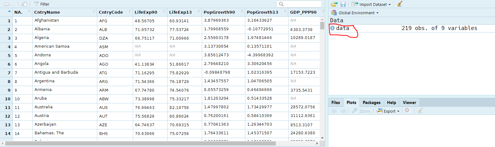

What you will learn during this exercise:

1. Get to know the user interface in R
2. Understand what is data table and what is unit and variable
3. Be able to sort values into a variable to identify units with min and max values
4. Be able to create frequency histograms and understand them
5. Be able to construct a change variable

# Grading

1. A maximum of 3 pages of PDF on BlackBoard within the deadline. Put your last name in the file name. Make sure you have a clear layout. Use only one language - either Norwegian or English in the answer. NB Failure to do so will count negatively in evaluation.

2. Questions asked in the exercise text may be repeated in the test on BlackBoard. ** You do not need to hand-in the questions**

# Preliminary steps

1- Create a folder on your home directory (go to 'my computer' and click into your 'Home directory (M :)') which you call, for example, Geog1004 \ Exercises. You may want to have individual subfolders - one for each exercise such as: M: \ Geog2015 \ exercises \ OV1

2-  Download the World_90_13.xlsx file from Exercise 1 into LM1 on the BlackBoard and save it to Exercise 1 folder that you created in a).

3- Open R.

4- Load the World_90_13.xlsx dataset in R (as you learnt during the tutorials)

```{r}
library(xlsx)
data <- read.xlsx('data/World_90_13.xlsx', sheetIndex = 1)
```

# Get to know the R interface

> * Remember the tutorials, what are the main panes in RStudio, what are their functions?

If you need some refreshment watch [this video](https://www.youtube.com/watch?v=5YmcEYTSN7k)

# Get to know the data

The data presented is taken from the World Bank's development indicators web pages and contains information on life expectancy, annual population growth and purchasing power adjusted gross domestic product per capita for 1990 and 2013 respectively.

```{r}
head(data) # Shows the 5 first rows
```

You can also visualize the entire dataset by clicking on the dataset name in your `Environment`. This will give you the result shown below:

```{r, echo = FALSE}

```

You can also learn about the type of variable (numeric, date, factor ...) in your dataset using `str()`:

```{r}
str(data)
```

> * How many variables do you have in your dataset? How many rows?
> * What is the unit of LifeExp90 and PopGrowth90?

# Create a histogram

In R, constructing a histogram or other graph is generally very easy. You have 2 options for this:

- You can use the base function `hist()`
- You can use the package `ggplot2` which enhance significatively the aesthetic of your graph.

Because `ggplot2` is more complex we will stick to the base graphics. Nevertheless if you are curious about using `ggplot2` to produce high quality graph I recommend you to read [this website](http://r-statistics.co/Complete-Ggplot2-Tutorial-Part1-With-R-Code.html).

Here, we will draw a histogram of gross national product per capita in 2013.

```{r}
hist(data$GDP_PPP13)
```

You can modify the graph to give a more relevant title and axis names:

```{r}
hist(data$GDP_PPP13,
     main = 'Histogram of the GDP per capita in 2013',
     xlab = 'GDP per capita in 2013',
     ylab = 'Frequency')
```

You can also add colors, change the size of the bins ... I let you discover the possibilities by typing `?hist`.

> * Where at the GDP per capita 2013 is Bostwana located? Between the minimum and the first quartile, between the first quartile and the median, between the median and the third quartile or between the third quartile and the maximum. (Hint: you can estimate this by using the function `summary()`)

> * Where at the GDP per capita 1990 is Norway located?

> * Where at the GDP per capita 2013 is Saudia Arabia located?

> * Draw a new histogram with the variable: Population growth 2013 (annual%). 

> * By drawing a histogram for the other variables, can you see if there is which look normally distributed? Which one?

# Create new variables for changes in gross domestic product, population growth and life expectancy

In step 4, we have given a static representation of the distribution for the variables gross national product and population growth for 2013. 

We now want to look at the changes between 1990 and 2013 in the individual countries for these two variables. We also want to do the same for the variable life expectancy. We must therefore construct three new variables representing these changes.

To add the new variable in the dataset you can do as follow:

```{r}
# Create a new column "changes_GDP" representing the difference between GDP in 2013 an GDP in 1990.
data$changes_GDP <- data$GDP_PPP13 - data$GDP_PPP90
```

We can check that the new variables has been created by for instance typing `str(data)`

```{r}
str(data)
```

> * Add variables representing the changes in population growth and life expectancy.

**Note 1:** The variable you have constructed is not change in population, but change in population growth. A country that had population growth in 1990 and also had population growth, but somewhat lower, in 2013 will have a negative value for the change variable. Although the country is experiencing growth in both years, growth has slowed. A country that has received a positive value means that population growth in 2013 was greater than population growth in 1990.

**Note 2:** Note: The gross domestic product variables are adjusted in two ways. First, one it adjusted with regard to purchasing power. With a 1 dollar spent in India you can buy much more than with a 1 dollar spent in the United States
(Check [wikipedia](http://en.wikipedia.org/wiki/Purchasing_power_parity for details)).
Secundly, the variable has been adjusted to dollar value as it was in 2011 (since 1 dollar in 1990 is different than a dollar in 2013).

**Note 3:** If one of the variables used to calculate the change variable is missing value for a country, the change variable will also be missing value for that country. Both variables used in the calculation must have value for the change variable to get value.

# Create frequency histograms of the new change variables and discuss the results

Create a histograms for your three new change variables as described in point 4. Study the data table and frequency histograms you have created and discuss with a fellow student:

> * Which country had the least change in population growth?

*Tip: you can use `which(max(data$...))` and `which(min(data$...))`. This will give you the row number of the maximum and minimum of your variable. You can then search for the corresponding country.

> *  Has population growth increased or decreased for most countries between 1990 and 2013?

> *  Has life expectancy increased or decreased for most countries between 1990 and 2013?

> *  What is the trend in population growth overall?

# Use hist() to create frequency histograms to be submitted for this exercise.

Create three histograms for the three change variables. Label the axis with relevant title and add colors to the histogram.

You should end up with 3 histograms.

# Save your histograms and place them in a word document ready for submission.

To save a graph you will need to select `Plots` on the lower right pane. Then select `Export > Save as image`.

```{r, echo = FALSE}
knitr::include_graphics('imgs_lab/lab_1/SaveImg.PNG')
```

*Note: If you use Norwegian in the exercise, remember to change all text in the figures to Norwegian.*

# Submission

As a hand in exercise 1 you must deliver:

* The three frequency charts for the change variables (from point 5) that you created in point 7.
* A text explaining briefly what frequency charts are for something and why it is useful to create such charts. Use your own words! (The answers will be checked for plagiarism)

Provide brief, descriptive character texts for each chart. Put them under the figure.

* What type of chart does the figure show? 
* What variables are used? 
* For what years? 

> Remember to be brief! Make sure that figure text and figure are on the same page.
> Remember that the answer must be a maximum of three pages long.
> Remember to convert the Word file to .pdf after you finish. To convert the file to PDF format, go to File and Save as Adobe PDF.

# Rubric

```{r, echo = FALSE}
rubrik <- data.frame(Questions = c("Histograms", "Figure caption"),
                     Level_1 = c("1 points: The hand-in only has 1 histogram",
                                 "1 points: The text describing the charts is not explicit enough"),
                     Level_2 = c("2 points: The hand-in only has 2 histogram",
                     "2 points: The text describing the charts is explicit enough"),
                     Level_3 = c("3 points: The hand-in has 3 histograms",
                                 "3 points: The text describing the charts is explicit enough & each histogram has a different color"))

knitr::kable(rubrik)
```


# Checklist

The submission must contain:

1. The three frequency histograms of the change variables you created.
2. Short and descriptive character texts under each of the frequency histograms.
3. A brief explanation of your own words about what a frequency histogram is and why it is useful to create such charts.

Now you are ready to submit your exercise: Upload the (max) 3-page PDF file on BlackBoard as a response to this exercise.

REMEMBER to include your last name in the file name and use only one language in the answer.
